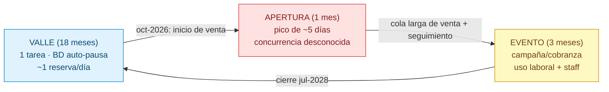
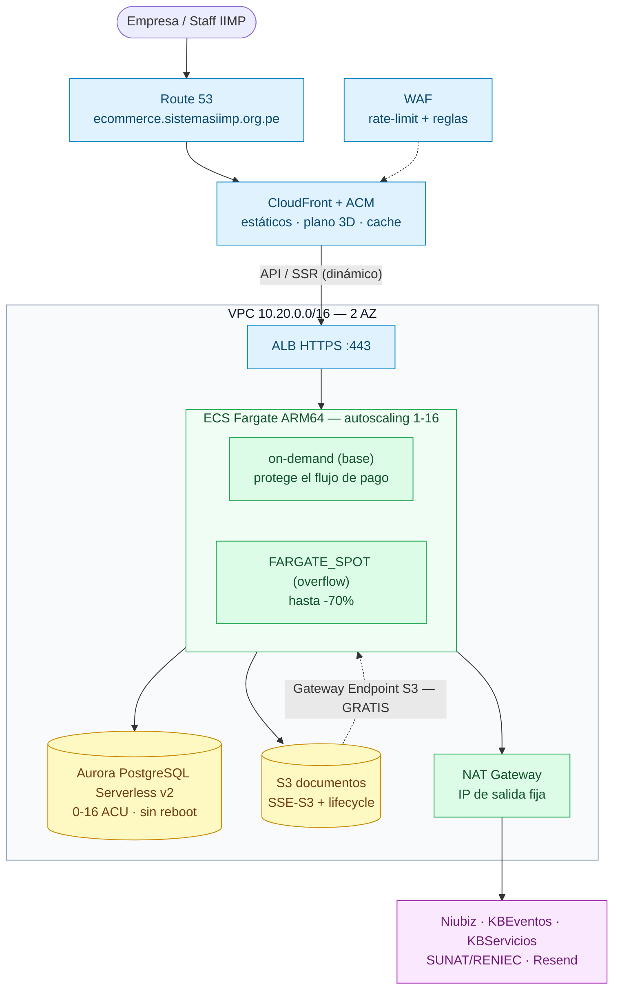
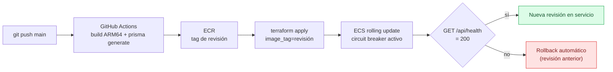

# Arquitectura AWS — Decisión para ContratosStands

> **Estado:** v5 — 2026-09-16 (**DECISIÓN CONFIRMADA por el dueño**: Opción 1 — ECS Fargate + Aurora Serverless v2 + ALB + CloudFront/WAF).
> Basada en: la documentación del proyecto (`docs/`, documentos 00-12), `docs/02-despliegue/REGLAS-DESPLIEGUE.md`
> (R1-R6) y las skills de AWS (`aws-containers`, `aws-database`, `aws-billing-and-cost-management`).
> **Precios:** obtenidos con AWS CLI (`pricing get-products`) sobre la **Price List API**, cuenta
> `517839275515` (sistemas.iimp), región `us-east-1`, al 2026-09-16. Todos los cálculos se hicieron
> con script (regla de la skill de costos: nunca aritmética "de memoria").
>
> **Vista previa visual:** `arquitectura-preview.html` (diagramas renderizados).
> Regenerar con `node scripts/build-arquitectura-preview.mjs`.

---

## 1. Requisitos que mandan el diseño

### 1.1 Contexto de negocio (definido por el dueño)

| Dato | Valor | Implicancia |
|---|---|---|
| Stands a comercializar | **~1.500** (80% de clientes externos ≈ 1.200 empresas) | ~1.200 reservas en total: **volumen bajo** |
| Ventana de venta | **oct-2026 → jul-2028 (22 meses)** | El **costo dominante es el baseline de 22 meses**, no el pico |
| Picos | **1 apertura** (oct-2026, magnitud desconocida) | La elasticidad importa ~1 mes de 22 |
| Post-venta | Seguimiento interno y procesos internos (Legal/Logística/Eventos) | Uso diario de pocas personas (staff), sin concurrencia masiva |
| Eventos que sirve | PERUMIN, ProExplo, WMC, GESS (multi-vertical) | El sistema es transversal a todo el portafolio |

### 1.2 Contexto técnico (de la documentación)

| Dimensión | Hallazgo (fuente) | Implicancia cloud |
|---|---|---|
| Desplegable | Monolito Next.js 16 (App Router + API hexagonal) — `stack-tecnologico.md` | Un solo artefacto; no microservicios |
| Datos | PostgreSQL 16 + Prisma 7; 14 tablas; stand/reserva/cuota/aprobación (`modelo-datos.md`) | BD **< 5 GB**; reservas ~1.200 en 22 meses |
| Archivos | Documentos subidos por cliente/admin; nginx permite 50 MB (`infraestructura-devops.md`) | **Atraviesan el servidor** (no pre-signed): rompe el límite de API Gateway/Lambda |
| Pagos | Niubiz: sesión y autorización server-to-server + redirect del navegador (`niubizz-service.ts`) | **Sin cold starts** en el camino del pago |
| Integraciones | KBEventos PlanoGESS, KBServicios, SUNAT/RENIEC, Resend, M2M con montaje-integral | Salidas estables; posible whitelisting de IP (`secure2.iimp.org`) |
| Facturación | **No** se implementa: se interopera con SAP/John (`resumen-ejecutivo.md`) | Sin cargas analíticas |
| Jobs | Ninguno (0 cron) | Todo es request-driven |
| UI pesada | Plano 3D (three.js) cliente | **CDN obligatoria** para el pico de assets |

### 1.3 Perfil de carga modelado



**Conclusión del perfil:** es una aplicación de **baja carga sostenida durante 22 meses con un único pico**.
El costo de infraestructura es casi todo *baseline*: ahorrar $50/mes vale **$1.100** al cierre.

---

## 2. Precios unitarios reales (us-east-1, 2026-09-16)

Extraídos de la Price List API (`aws pricing get-products`):

| Recurso | Precio |
|---|---|
| Fargate **ARM** (vCPU / GB) | $0.03238 / $0.00356 por hora |
| Fargate x86 (vCPU / GB) | $0.04048 / $0.004445 por hora |
| Fargate Spot | hasta −70% (precio dinámico, fuera de la Price List) |
| EC2 **t4g.medium** (ARM, Linux) | $0.0336/hr |
| RDS PostgreSQL **db.t4g.micro / small / medium** | $0.016 / $0.032 / $0.065 por hora |
| **Aurora PostgreSQL Serverless v2** | **$0.12 / ACU-hr** · storage $0.10/GB-mo · IO $0.20/M |
| Lambda ARM | $0.0000106667/GB-s + $0.20/M requests |
| ALB | $0.0225/hr + $0.004/LCU-hr |
| **NAT Gateway** | **$0.045/hr + $0.045/GB ≈ $33/mes** |
| CloudFront | $0.08/GB + $0.75/M requests |
| S3 Standard / ECR / Secrets | $0.022/GB-mo · $0.10/GB-mo · $0.40/secreto |
| WAF | $5/WebACL + $1/regla + $0.60/M requests |

> **NAT Gateway ≈ $33/mes** es el "costo sorpresa #1" señalado por la skill de costos. Es el 35% del
> baseline de las opciones que lo requieren — por eso la opción recomendada **no lo usa**.

---

## 3. Opciones evaluadas

| Opción | Resultado |
|---|---|
| **A (=Opc. 1). ECS Fargate + Aurora Serverless v2 + ALB + CloudFront/WAF** | ✅ **DECIDIDA** (elasticidad end-to-end para un proceso comercial con demanda desconocida) |
| **B (=Opc. 2). EC2 t4g + Nginx + RDS t4g + CloudFront/WAF (sin NAT ni ALB)** | Descartada: ~USD 1.386 más barata, pero **no es elástica** (RDS exige reboot de 5-10 min para crecer y el cómputo requiere intervención) |
| **C (=Opc. 3). Serverless: Lambda (OpenNext) + Aurora v2 + RDS Proxy** | Descartada: cuesta más que la 2, exige refactor de uploads y tiene cold starts en el pago |
| App Runner | ❌ **Eliminada**: sunset 30-abr-2026, sin nuevos clientes (`aws-containers`) |
| *(referencia)* EC2 + Docker Compose actual | Estado actual transitorio (sin HA ni escalado gestionado) |

### 3.1 Opción A — ECS Fargate elástico + Aurora Serverless v2

```
CloudFront+WAF → ALB → ECS Fargate (ARM, on-demand + Spot) → Aurora v2 (auto-pausa) + S3
                        NAT → Niubiz · KBEventos · SUNAT · Resend
```

- ✅ HA real, autoscaling, **cero parcheo** de servidores, circuit breaker con rollback
- ✅ Aurora escala sola (0-16 ACU) — no hay que adivinar la magnitud del pico
- ❌ Paga NAT ($33/mes) y ALB ($17/mes) los 22 meses
- **Costo real 22 meses: $2.498 (~$114/mes)** · apertura: $291

### 3.2 Opción B — EC2 t4g + Nginx + RDS t4g *(recomendada)*

```
CloudFront+WAF → EC2 t4g (ARM, Nginx + Next standalone, ASG min=1) → RDS PG t4g + S3
                        EIP (IP fija, sin NAT)
```

- ✅ **La mitad de costo**: sin NAT (−$33) ni ALB (Nginx en el propio EC2)
- ✅ **IP de salida fija por EIP** (gratis con la instancia) — útil si `secure2.iimp.org` filtra por IP
- ✅ El equipo ya opera este modelo (es el actual, con RDS separado y CloudFront delante)
- ✅ ARM (Graviton) −20%
- ❌ Sin HA nativa: **mitigable** con ASG `min=1` (auto-recuperación), RDS con backups automáticos,
  y **Multi-AZ solo en los meses de campaña**; requiere parcheo periódico
- **Costo real 22 meses: $1.112 (~$51/mes)** · apertura: $146

### 3.3 Opción C — Serverless (Lambda OpenNext + Aurora v2 + RDS Proxy)

- ✅ Cero costo de cómputo en idle
- ❌ **Cuesta más que B** ($1.988 vs $1.112): el sistema **nunca está realmente idle** (venta 22 meses +
  uso diario de staff), y suma NAT ($33) + RDS Proxy (~$15/mes) + baseline de Aurora
- ❌ **Exige refactor** de uploads a pre-signed S3 (el límite de 6-10 MB rompe los 50 MB actuales)
- ❌ Cold starts en el flujo de pago Niubiz (riesgo justo donde hay dinero)
- **Costo real 22 meses: $1.988 (~$90/mes)**

---

## 4. Comparativa y decisión

| Criterio | A · Fargate+Aurora | **B · EC2+RDS** | C · Serverless |
|---|---|---|---|
| **Costo 22 meses (real)** | $2.498 | **$1.112** | $1.988 |
| Elasticidad del pico | ✅✅ | ⚠️ (ASG escala vertical/horizontal) | ✅✅ |
| HA / despliegue sin downtime | ✅✅ | ⚠️ (mitigable: ASG + Multi-AZ en campaña) | ✅ |
| Ops para equipo pequeño | ✅✅ (cero parcheo) | ⚠️ (parchear) | ✅ |
| Sin refactor de la aplicación | ✅ | ✅ | ❌ |
| IP de salida fija | ✅ (NAT) | ✅ (EIP, gratis) | ✅ (NAT) |
| Riesgo en el flujo de pago | Bajo | Bajo | Medio (cold start) |
| Con Compute Savings Plans 1 año | ~−$375 | ~−$222 | — |

### DECISIÓN: **Opción 1 — ECS Fargate + Aurora Serverless v2 + ALB + CloudFront/WAF**

**Fundamento (dado por el dueño):** son **procesos comerciales** (venta de stands, pagos de empresas)
con **demanda desconocida en la apertura**. La arquitectura debe ser **elástica sin intervención humana**,
porque el ajuste manual (y más aún un reboot de BD) en plena venta es inaceptable.

**Por qué se descartó la opción barata (B):** por **USD 63/mes** (~USD 1.386 en 22 meses) se compra
exactamente lo que el proceso comercial necesita — **elasticidad automática de cómputo y de base de datos**,
sin parcheo de servidores y con IP de salida fija. El costo de **perder horas de venta en la apertura** supera
ampliamente esa prima.

**Criterios de reversión (revisar si):** el tráfico real medido resultara 10× menor y sin picos, o si el
presupuesto se recortara de forma que la prima sea inadmisible → volver a la Opción 2 (escalable con
planificación) sin reescribir la aplicación (mismo `Dockerfile.ecs`).

---

## 5. Arquitectura decidida (Opción 1)



### Componentes (con sus tags obligatorias)

| Componente | Recurso AWS | Tag `component` | Notas |
|---|---|---|---|
| `network` | VPC 2 AZ, subnets públicas/privadas, **NAT (prod)** + **Gateway Endpoint S3 (gratis)** | `network` | NAT da IP de salida fija para las integraciones IIMP |
| `database` | **Aurora PostgreSQL Serverless v2** (min/max ACU por variable) | `database` | Elasticidad sin reboot; `DATABASE_URL` vía Secrets Manager |
| `storage` | S3 documentos (SSE-S3, privado, versioning + lifecycle) | `storage` | `STORAGE_PROVIDER=s3` |
| `app` | ECR + ALB (HTTPS ACM) + **ECS Fargate ARM64** (capacity providers on-demand + Spot) | `app` | Next.js `output: standalone` |
| `app` (módulo `cloudfront`) | CloudFront + ACM (us-east-1) + WAF | `app` | Cache de estáticos/plano 3D; WAF rate-based |
| `secrets` | Secrets Manager | `secrets` | Inyectados como env de la tarea |
| `app` (módulo `observability`) | CloudWatch Logs/Alarmas + **AWS Budgets** | `app` | Logs 30d, alarmas 5xx/latencia/CPU/ACU, budget por entorno |

> **Nota R3:** `component` admite únicamente `network | database | storage | secrets | app`
> (REGLAS-DESPLIEGUE.md). CloudFront/WAF y la observabilidad se etiquetan `app` porque sirven y
> monitorean la aplicación; el nombre del módulo Terraform conserva su identidad (`cloudfront`,
> `observability`).

Todos los recursos llevan: `project=contratos-stands`, `environment=qa|prod`, `managed-by=terraform`, `cost-center=eventos-iimp` (ver `terraform/AGENTS.md`).

---

## 6. Optimizaciones de costo aplicadas (skills de AWS)

| # | Optimización | Efecto | Fuente |
|---|---|---|---|
| C1 | **Gateway Endpoint S3 (gratis)** — el tráfico de documentos NO pasa por NAT | Evita el consumo más caro del NAT | `service-optimization.md` |
| C2 | **Aurora Serverless v2** (min 0 ACU en valle) | BD sin costo de cómputo entre eventos; escala sola en la apertura | `aws-database` |
| C3 | **ARM / Graviton** en las tareas Fargate | −20% de cómputo | `service-optimization.md` |
| C4 | **Fargate Spot para el overflow** (base on-demand) | Hasta −70% en capacidad de ráfaga | `service-optimization.md` |
| C5 | **Autoscaling por demanda + pre-warm acotado** | No pagar capacidad de pico durante 22 meses | perfiles |
| C6 | **Compute Savings Plans 1 año** (ventana de 22 meses lo justifica) | ~−17-20% en cómputo | `savings-plans.md` |
| C7 | **S3 lifecycle + `NoncurrentVersionExpiration`** | Evita versiones acumuladas silenciosas | `service-optimization.md` |
| C8 | **CloudWatch Logs retención 30d** | Evita logs "Never expire" | `service-optimization.md` |
| C9 | **AWS Budgets + alertas** | Detecta desvíos antes de la factura | `budgets.md` |
| C10 | QA desechable (destroy/recreate por Terraform) | QA no se paga cuando no se usa | R5 |

---

## 7. Flujo de despliegue



**Migración de BD**: `npx prisma migrate deploy` en el entrypoint del contenedor (antes de `node server.js`).
Si falla, el arranque aborta y el circuit breaker conserva la revisión anterior — la BD **NUNCA** se recrea.

---

## 8. Variables de entorno en producción

| Variable | Fuente |
|---|---|
| `DATABASE_URL` | RDS (Secrets Manager) |
| `JWT_SECRET` | Secrets Manager (generado por Terraform) |
| `SUNAT_API_TOKEN` / `RESEND_API_KEY` | Secrets Manager (opcionales) |
| `PLANOGESS_API_URL` / `KBSERVICIOS_URL` | Variables de Terraform (endpoints KBEventos) |
| `ADMIN_EMAIL` | Variable de Terraform |
| `STORAGE_PROVIDER=s3`, `S3_BUCKET`, `S3_REGION`, `S3_ENDPOINT` | Outputs de Terraform |
| `NEXT_PUBLIC_APP_URL` / `APP_URL` / `NEXT_PUBLIC_APP_ENV` | `https://ecommerce.sistemasiimp.org.pe` / `production` |

**Dominio de producción**: `https://ecommerce.sistemasiimp.org.pe` (var `app_domain`);
certificado ACM en **us-east-1** para CloudFront y para el ALB/instancia.

---

## 9. Paquete de implementación (Terraform)

> Objetivo: alinear `terraform/` con la decisión v5 (Opción 1).

| Módulo | Acción |
|---|---|
| `network` | VPC 2 AZ + NAT (prod) + **Gateway Endpoint S3** |
| `aurora` (nuevo) | Aurora PostgreSQL Serverless v2 (min/max ACU por variable; min 0 = auto-pausa en valle) — reemplaza `database` (RDS) |
| `database` | Se **retira** (queda el histórico en git) |
| `storage` | + lifecycle (`NoncurrentVersionExpiration` + transición a Intelligent-Tiering) |
| `secrets` | Sin cambios de diseño (apunta al endpoint de Aurora) |
| `ecs` | **ARM64** + capacity providers `FARGATE`/`FARGATE_SPOT` + autoscaling por `ALBRequestCountPerTarget` y CPU + `aws_appautoscaling_scheduled_action` (pre-warm) + **ECR gestionado por Terraform** |
| `cloudfront` (nuevo) | Distribución + ACM (us-east-1) + WAF + registros DNS opcionales |
| `observability` (nuevo) | Alarmas (5xx, latencia, CPU, ACU) + `aws_budgets_budget` por entorno |
| `perfiles/*.tfvars` | `valle` · `evento` · `apertura` (ACU, capacité del servicio, pre-warm, WAF) |
| `scripts/loadtest/` | k6 para medir la apertura en QA antes de oct-2026 |

---

## 10. Pendientes

- [x] **Decisión de arquitectura: Opción 1** (confirmada por el dueño, 2026-09-16)
- [ ] **Zona DNS**: ¿`ecommerce.sistemasiimp.org.pe` está en Route 53 o se administra fuera?
      Si está fuera, el certificado ACM se valida con los CNAME que emite Terraform (`terraform output acm_validation_records`)
      y el `apply` va en **dos pasos** (`enable_https=false`/`enable_cloudfront=false` → cargar DNS → `true`).
      Detalle: `terraform/AGENTS.md`.
- [ ] ¿Los servicios de IIMP (`secure2.iimp.org`) exigen **IP fija / whitelisting**? (el NAT ya la entrega)
- [ ] ¿Se contrata **Compute Savings Plans 1 año**? (−17-20%)
- [ ] Cuenta AWS definitiva (`sistemas-aws` asumida — R4) y entorno inicial (`qa`)
- [ ] ⚠️ **Bloqueante técnico previo a cualquier despliegue**: el build falla por `client-only`
      importado desde un Server Component (`src/lib/client/api/*` ← `plano-grid/page.tsx`).
      Sin eso no se genera la imagen.
