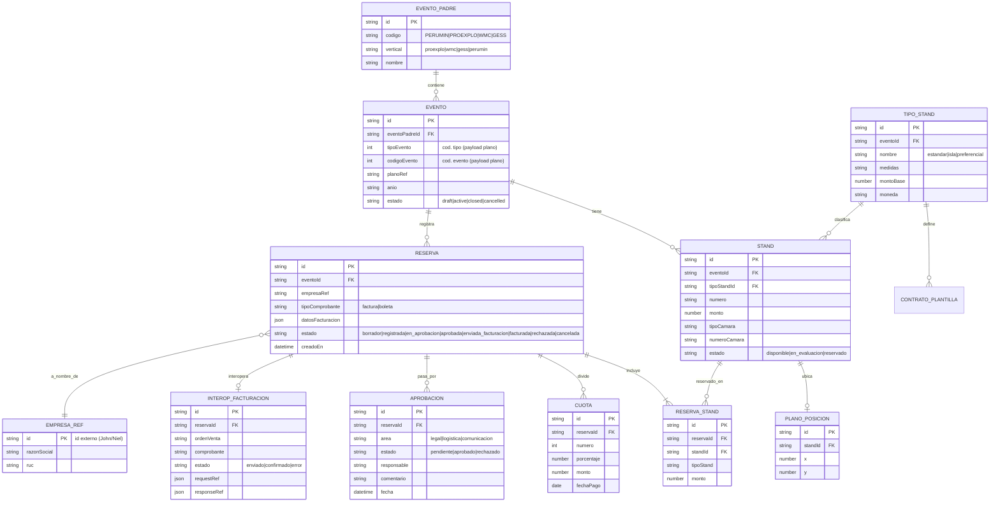

# Modelo de Datos — ContratosStands

> **Estado:** v0.4 — incluye modelos GessStand, Role, UserRole y la integración SGC
> (`sgc_expediente`, `sgc_documento`, `sgc_webhook_evento`). Motor confirmado: PostgreSQL + Prisma v7.
> **Relacionado:** `docs/00-inicio/requerimientos.md`, `.opencode/reglas/lineamientos-bd`.

## 1. Alcance del modelo

- Se **persiste** solo el dominio propio del proceso de **reserva**.
- Se **consume** (no se duplica) la información transversal: **empresas/personas**
  (sistema de John / base centralizada de Niel) y la **configuración contable** (SAP).
- Multievento: relación **padre → evento (versión)**; todo se filtra por evento.

## 2. Convenciones aplicadas

- Identidad única (**PK obligatoria**) en toda entidad; integridad referencial (**FK**).
- Índices en campos de búsqueda/filtro: `eventoId`, `estado`, `empresaId`, `standId`.
- Campos de auditoría en toda tabla: `creadoEn`, `actualizadoEn`, `creadoPor`.
- Nomenclatura relacional (si se genera DDL a mano): `TB<T>_CTRST_<DESCRIPCION>`,
  `PK_<TABLA>`, `FK_<ORIG>_<DEST>`, `IDX_<TABLA>_<CAMPO>` (módulo sugerido: `CTRST`).
- Si se usa ORM, el modelo se define en código y la nomenclatura relacional es solo
  referencia para el mapeo/migraciones.

## 3. Diagrama entidad-relación (lógico)

## 4. Diccionario de datos (entidades propias)

### 4.1 `evento_padre` (Maestra)
| Campo | Tipo | Nulo | Descripción |
| --- | --- | --- | --- |
| id | id/uuid | No | PK. |
| codigo | string(20) | No | PERUMIN / PROEXPLO / WMC / GESS. |
| vertical | enum | No | proexplo/wmc/gess/perumin (alineado al UI Kit). |
| nombre | string(100) | No | Nombre visible. |

### 4.2 `evento` (Maestra)
| Campo | Tipo | Nulo | Descripción |
| --- | --- | --- | --- |
| id | id/uuid | No | PK. |
| eventoPadreId | FK | No | → evento_padre. |
| tipoEvento | int | No | Código de tipo (payload del plano). |
| codigoEvento | int | No | Código de evento (payload del plano). |
| planoRef | string | Sí | Referencia/URL del plano. |
| anio | string(4) | No | Año/versión. |
| estado | enum | No | draft/active/closed/cancelled. |

### 4.3 `tipo_stand` (Maestra)
| Campo | Tipo | Nulo | Descripción |
| --- | --- | --- | --- |
| id | id/uuid | No | PK. |
| eventoId | FK | No | → evento. |
| nombre | string(50) | No | estandar/isla/preferencial. |
| medidas | string(50) | Sí | Dimensiones. |
| montoBase | number | No | Precio base del tipo. |
| moneda | string(3) | No | USD/PEN. |

### 4.4 `stand` (Transaccional)
| Campo | Tipo | Nulo | Descripción |
| --- | --- | --- | --- |
| id | id/uuid | No | PK. |
| eventoId | FK | No | → evento. |
| tipoStandId | FK | No | → tipo_stand. |
| numero | string(20) | No | Número visible del stand. |
| monto | number | No | Monto del stand. |
| tipoCamara | string(20) | Sí | Campo de cámara (tipo). |
| numeroCamara | string(20) | Sí | Campo de cámara (número). |
| estado | enum | No | disponible/en_evaluacion/reservado. |

Índice sugerido: `IDX_STAND_EVENTO_ESTADO (eventoId, estado)`.

### 4.5 `plano_posicion` (Transaccional)
| Campo | Tipo | Nulo | Descripción |
| --- | --- | --- | --- |
| id | id/uuid | No | PK. |
| standId | FK | No | → stand. |
| x | number | No | Coordenada X (relativa/responsive). |
| y | number | No | Coordenada Y (relativa/responsive). |

> Origen de X/Y: servicio de John **(PC)**; puede consumirse sin persistir.

### 4.6 `reserva` (Transaccional)
| Campo | Tipo | Nulo | Descripción |
| --- | --- | --- | --- |
| id | id/uuid | No | PK. |
| eventoId | FK | No | → evento. |
| empresaRef | string | No | Id externo de empresa (John/Niel). |
| tipoComprobante | enum | No | factura/boleta. |
| datosFacturacion | json | No | Razón social/RUC o nombre/doc/dirección, correo. |
| responsablePago | json | Sí | Nombre, teléfono, correo. |
| estado | enum | No | Ciclo de vida (ver requerimientos §8.5). |
| creadoEn/actualizadoEn/creadoPor | audit | No | Auditoría. |

Restricción sugerida: evitar doble reserva activa del mismo `standId` por evento.

### 4.7 `reserva_stand` (Transaccional)
| Campo | Tipo | Nulo | Descripción |
| --- | --- | --- | --- |
| id | id/uuid | No | PK. |
| reservaId | FK | No | → reserva. |
| standId | FK | No | → stand. |
| tipoStand | string | No | Snapshot del tipo al reservar. |
| monto | number | No | Snapshot del monto. |

### 4.8 `cuota` (Transaccional)
| Campo | Tipo | Nulo | Descripción |
| --- | --- | --- | --- |
| id | id/uuid | No | PK. |
| reservaId | FK | No | → reserva. |
| numero | int | No | N.º de cuota. |
| porcentaje | number | No | % de la cuota (suma = 100). |
| monto | number | No | Monto prorrateado. |
| fechaPago | date | Sí | Fecha comprometida. |

### 4.9 `aprobacion` (Transaccional)
| Campo | Tipo | Nulo | Descripción |
| --- | --- | --- | --- |
| id | id/uuid | No | PK. |
| reservaId | FK | No | → reserva. |
| area | enum | No | legal/logistica/comunicacion. |
| estado | enum | No | pendiente/aprobado/rechazado. |
| responsable | string | Sí | Usuario que resuelve. |
| comentario | string | Sí | Observación. |
| fecha | datetime | Sí | Fecha de resolución. |

### 4.10 `interop_facturacion` (Control)
| Campo | Tipo | Nulo | Descripción |
| --- | --- | --- | --- |
| id | id/uuid | No | PK. |
| reservaId | FK | No | → reserva. |
| ordenVenta | string | Sí | N.º orden de venta (SAP). |
| comprobante | string | Sí | N.º factura/boleta (SAP). |
| estado | enum | No | enviado/confirmado/error. |
| requestRef / responseRef | json | Sí | Trazabilidad del intercambio. |

### 4.11 `audit_log` (Log)
| Campo | Tipo | Nulo | Descripción |
| --- | --- | --- | --- |
| id | id/uuid | No | PK. |
| tipo | enum | No | reserva/aprobacion/interop/error/seguridad. |
| entidad | string | Sí | Entidad afectada + id. |
| actor | string | Sí | Usuario/servicio. |
| mensaje | string | No | Detalle. |
| metadata | json | Sí | Contexto. |
| creadoEn | datetime | No | Timestamp. |

### 4.12 `gess_stand` (Datos del API planogess)

| Campo | Tipo | Nulo | Descripción |
| --- | --- | --- | --- |
| id | id/uuid | No | PK. |
| eventoId | FK | No | → evento. |
| standApiId | string(50) | No | UID del stand en el API externo. |
| standCode | string(50) | No | Código visible (01, 02, ...). |
| tipoStand | string(100) | Sí | PREFERENCIAL / ESTANDAR_01 / ISLAS. |
| medidas | string(100) | Sí | Ej: "3000.00 US$". |
| estado | string(50) | Sí | Disponible / Reservado. |
| empresa | string(200) | Sí | Nombre de la empresa que reservó. |
| pabellon | string(50) | Sí | Coordenadas X,Y. |
| bloqueId | string(50) | Sí | ID del bloque 3D vinculado (EXT-IZQ-01, ...). |
| documentos | json | Sí | URLs de documentos del stand. |
| imagenes | json | Sí | URLs de imagenes del stand. |
| imagenesCategorias | json | Sí | Categoria por imagen: `{ "<url>": "<categoria>" }` (ver `CATEGORIAS_IMAGEN`). |
| rawData | json | Sí | Respuesta completa del API externo. |

Unique: `[eventoId, standApiId]`. Índices: `eventoId`, `bloqueId`.

### 4.13 `role` (Roles del sistema)

| Campo | Tipo | Nulo | Descripción |
| --- | --- | --- | --- |
| id | id/uuid | No | PK. |
| nombre | string(50) | No | Único: admin/logistica/legal/comunicacion. |
| descripcion | string(200) | Sí | Descripción del rol. |
| permisos | string[] | No | Array de permisos asignados. |

### 4.14 `user_role` (Asignación rol ↔ usuario)

| Campo | Tipo | Nulo | Descripción |
| --- | --- | --- | --- |
| id | id/uuid | No | PK. |
| userId | string(100) | No | ID del usuario (ej: `user\|email`). |
| roleId | FK | No | → role. |
| email | string(200) | No | Email del usuario. |

Unique: `[userId, roleId]`. Índices: `userId`, `email`.

### 4.15 `sgc_expediente` (Integración · correlación)

Correlación 1:1 entre una `solicitud` local y su expediente en el Sistema de Gestión
de Contratos (SGC). Ver `docs/05-integraciones/integracion-sgc.md`.

| Campo | Tipo | Nulo | Descripción |
| --- | --- | --- | --- |
| id | id/uuid | No | PK. |
| solicitudId | FK (unique) | No | → solicitud. |
| code | string(50) (unique) | No | Código de negocio enviado al SGC (ej. `STAND-2026-0042`). |
| contractId | string(64) (unique) | Sí | UUID interno devuelto por el SGC. |
| estadoEnvio | enum | No | pendiente/creado/error. |
| stage | string(40) | Sí | Etapa del SGC (drafting/internal-review/approval/validity/closed). |
| lifecycleStatus | string(20) | Sí | active/finalized/observed/rejected. |
| version | int | Sí | Versión del expediente en el SGC. |
| areaCode | string(40) | No | Catálogo del SGC. |
| contractTypeCode | string(40) | No | Catálogo del SGC. |
| lastSyncedAt | datetime | Sí | Última sincronización. |
| lastError | string(500) | Sí | Último error (best-effort). |

Índices: `estadoEnvio`, `stage`.

### 4.16 `sgc_documento` (Integración · piezas documentales)

Correlación de cada pieza documental empujada al SGC.

| Campo | Tipo | Nulo | Descripción |
| --- | --- | --- | --- |
| id | id/uuid | No | PK. |
| sgcExpedienteId | FK | No | → sgc_expediente. |
| documentId | string(64) (unique) | No | Id de la pieza en el SGC. |
| currentVersionId | string(64) | Sí | Versión vigente en el SGC. |
| category | enum | No | contract/annex. |
| title | string(200) | No | Título visible. |
| fileName | string(255) | No | Nombre del archivo. |
| checksumSha256 | string(64) | Sí | Hash SHA-256 del binario. |
| sizeBytes | int | Sí | Tamaño. |
| estado | enum | No | reservado/subido/confirmado/rechazado. |

Índice: `sgcExpedienteId`.

### 4.17 `sgc_webhook_evento` (Integración · inbox idempotente)

Bitácora de webhooks recibidos del SGC; deduplica por `eventId`.

| Campo | Tipo | Nulo | Descripción |
| --- | --- | --- | --- |
| id | id/uuid | No | PK. |
| eventId | string(64) (unique) | No | Id de evento del SGC (idempotencia). |
| eventType | string(40) | No | workflow.* / contract.closed. |
| resourceId | string(64) | Sí | contractId del recurso. |
| resourceCode | string(50) | Sí | `code` de negocio. |
| payload | json | No | Cuerpo recibido. |
| procesadoAt | datetime | Sí | Fecha de procesamiento. |
| error | string(500) | Sí | Error de procesamiento (si hubo). |

Índices: `eventType`, `resourceId`.

### 4.18 `sgc_outbox` (Integración · cola de salida)

Operaciones hacia el SGC con reintentos y backoff. Ver `docs/05-integraciones/integracion-sgc.md`.

| Campo | Tipo | Nulo | Descripción |
| --- | --- | --- | --- |
| id | id/uuid | No | PK. |
| operacion | enum | No | subir-contrato / subir-anexos / subsanar. |
| idempotencyKey | string(160) (unique) | Sí | Clave de idempotencia. |
| payload | json | No | Datos para re-ejecutar la operación. |
| estado | enum | No | pendiente/enviado/error. |
| intentos | int | No | Reintentos realizados. |
| ultimoError | string(500) | Sí | Último error. |
| programadoAt | datetime | No | Próximo intento (backoff). |

Índice: `(estado, programadoAt)`.

### 4.19 `solicitud_cuenta` (Transaccional · acceso)

Solicitud de cuenta de nuevo exhibidor enviada desde el portal publico
(`/auth/solicitar-cuenta`). Nace en estado `pendiente` y la resuelve un
administrador.

| Campo | Tipo | Nulo | Descripción |
| --- | --- | --- | --- |
| id | id/uuid | No | PK. |
| email | string(200) | No | Correo corporativo del solicitante. |
| nombre | string(200) | No | Nombres del contacto. |
| apellidos | string(200) | No | Apellidos del contacto. |
| telefono | string(20) | Sí | Teléfono de contacto. |
| razonSocial | string(200) | No | Razón social de la empresa exhibidora. |
| ruc | string(11) | Sí | RUC de la empresa. |
| cargo | string(100) | Sí | Cargo del contacto. |
| mensaje | text | Sí | Mensaje adicional del solicitante. |
| estado | enum | No | pendiente/aprobada/rechazada. |
| motivoRechazo | text | Sí | Obligatorio al rechazar. |
| revisadoPor | string(200) | Sí | Email del administrador que revisó. |
| revisadoEn | datetime | Sí | Fecha de la revisión. |
| usuarioId | string(100) | Sí | `userId` creado al aprobar la solicitud. |

Índices: `email`, `estado`.

### 4.20 `registro_pendiente` (Temporal · acceso)

Registro de exhibidor creado desde el modal de reserva (auto-registro) mientras se
verifica el correo por codigo. La contrasena se guarda **ya hasheada** y se transfiere
al usuario al confirmar; el registro se elimina una vez verificado o vencido.

| Campo | Tipo | Nulo | Descripción |
| --- | --- | --- | --- |
| id | id/uuid | No | PK. |
| email | string(200) | No | Correo a verificar. **Único**. |
| codigo | string(10) | No | Codigo numerico enviado por correo (6 digitos). |
| password | string(100) | No | Contrasena hasheada (scrypt). |
| nombre | string(200) | No | Nombres del contacto. |
| apellidos | string(200) | No | Apellidos del contacto. |
| razonSocial | string(200) | No | Razón social (autocompletada con SUNAT). |
| ruc | string(11) | Sí | RUC de la empresa. |
| telefono | string(20) | Sí | Teléfono de contacto. |
| intentos | int | No | Intentos de verificación fallidos (máx. 5). |
| expiraEn | datetime | No | Vencimiento del código (15 min). |

Índices: `email` (único).

## 5. Entidades consumidas (externas, no persistidas como maestra)

- **`empresa` / `persona_contacto`** — origen: sistema de John o base centralizada de
  Niel. Se consume por API; a lo sumo se cachea `empresaRef` en `reserva`.
- **Configuración contable** (centro de costo, cuentas contables, tipos de afectación,
  tasas) — origen: **SAP**. Fuera de este sistema.

## 6. Pendientes (PC)

- ~~Confirmar **motor de BD** (relacional vs. documental) y ORM.~~ → **PostgreSQL + Prisma v7**.
- Confirmar **fuente única** de empresas/personas y estrategia de sincronización.
- Confirmar si `plano_posicion` se persiste o solo se consume del servicio de John.
- Definir reglas de unicidad/bloqueo para prevenir doble reserva (concurrencia).
