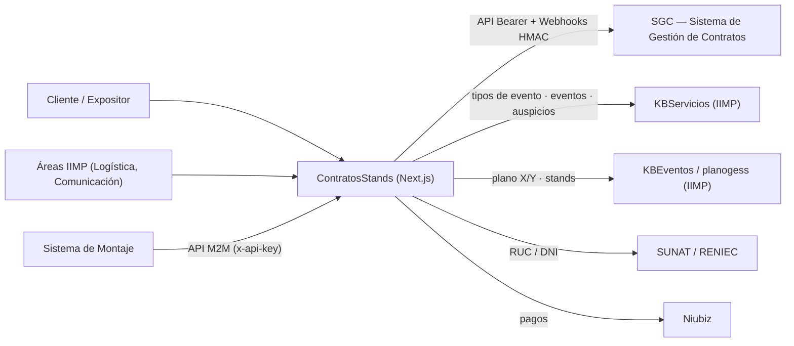
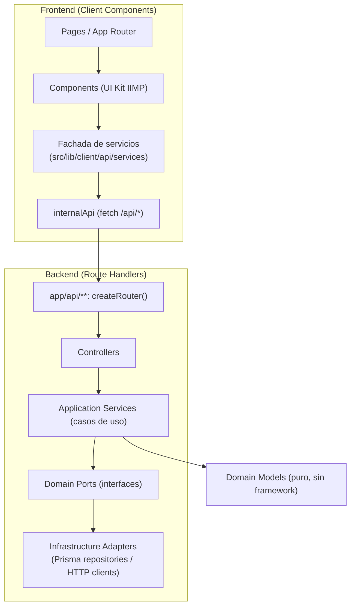
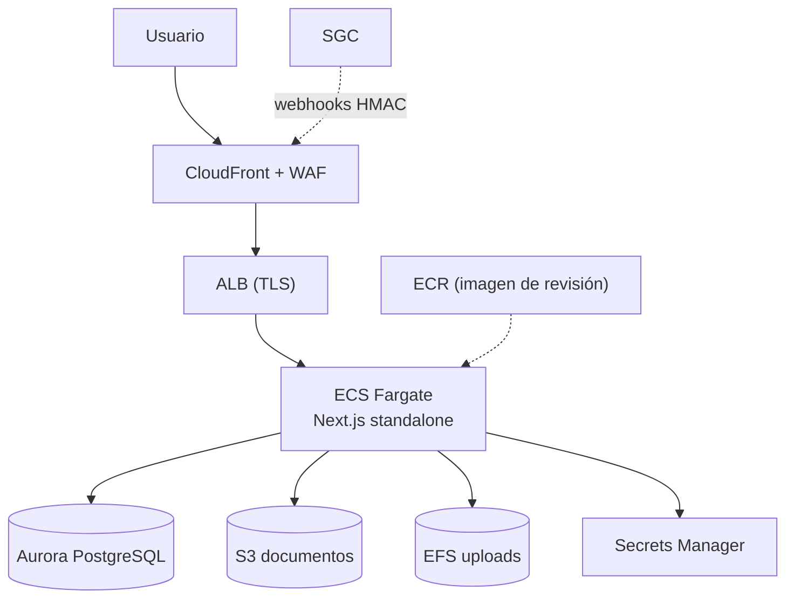
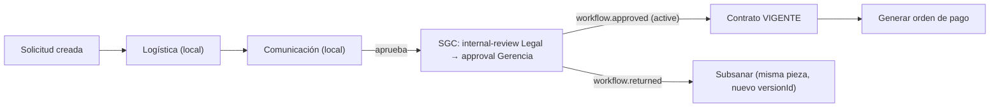
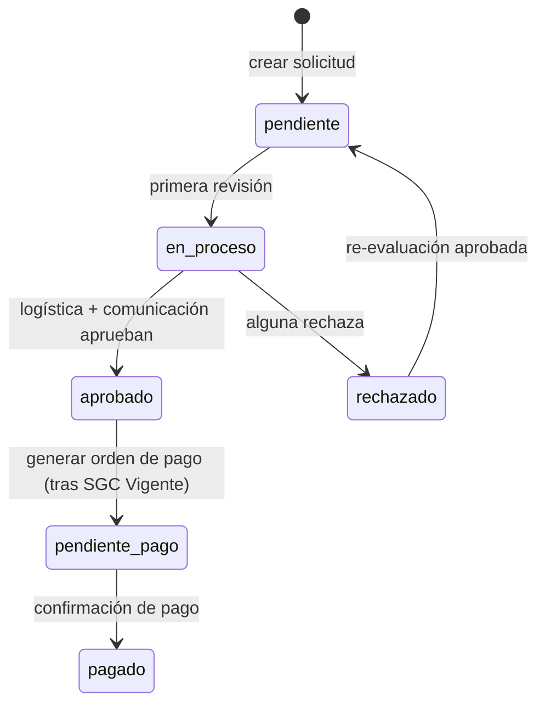

# Visión general de la arquitectura (diagramas)

> Diagramas Mermaid de alto nivel. Detalle de despliegue AWS:
> [`../02-despliegue/arquitectura-aws.md`](../02-despliegue/arquitectura-aws.md).
> Estructura de carpetas: [`arquitectura.md`](./arquitectura.md). Modelo de datos:
> [`modelo-datos.md`](./modelo-datos.md). Integración SGC:
> [`../05-integraciones/integracion-sgc.md`](../05-integraciones/integracion-sgc.md).

## 1. Contexto — sistemas e integraciones

## 2. Capas — Hexagonal (backend) + Fachada (frontend)

## 3. Despliegue (AWS) — resumen

## 4. Flujo de revisión → SGC (resumen)

## 5. Estados de la solicitud

