# Integración con el SGC (Sistema de Gestión de Contratos)

> Estado: **implementado y desplegado** (la app apunta al SGC **QA**). Ver la
> "Actualización guía v2" más abajo. Rol de ContratosStands: **cliente (consumidor)** de la
> API de integración del SGC. Documento guía de referencia: `APIS_USE_HOOKS.md`
> (provisto por el equipo del SGC); referencia técnica canónica del SGC:
> `docs/INTEGRATIONS.md` (en el repo del SGC).
>
> Avance: **Fases 0, 1 y 2 completadas**.
> Fase 0: constantes SGC_*, contratos de la API externa en `src/domain/models/sgc.ts`,
> puertos, adaptador mock, config de env, wiring y tests.
> Fase 1: modelos Prisma `SgcExpediente`/`SgcDocumento`, repositorio, mapper
> (`src/lib/shared/mappers/sgc.ts`), servicio `SgcIntegracionApplicationService` y disparo
> al aprobar **Comunicación** (`SolicitudApplicationService.revisar`; la revisión Legal se
> delega al SGC). Best-effort: un fallo del SGC se registra (`estadoEnvio=error`) y nunca
> bloquea la aprobación. Dormido hasta `SGC_ENABLED=1`.
> Fase 2: subida en 3 fases (`reservar → transferir → confirmar`) con checksum SHA-256,
> puerto `IDocumentoOrigen` + adaptador (`documento-origen.ts`) y `subirAnexosDeSolicitud`.
> El origen del **contrato v1** (categoría `contract`) aún no está definido (decisión §13.5);
> `subirPiezaDocumental`/`subirDocumentoDesdeUrl` quedan listos para conectarlo.
> Fase 3: `consultarExpediente` (sincroniza stage/lifecycle/version) + `GET /api/sgc/detalle`
> (protegido con `solicitudes:view`), fachada `sgcService`, hook `useSgcExpediente` y panel
> `SgcExpedientePanel` (stepper + historial) en el detalle de la solicitud.
> Fase 4: webhooks — `POST /api/integracion/sgc/webhook` (público, runtime Node) con
> verificación HMAC-SHA256 (`timingSafeEqual` propio + ventana de tolerancia), inbox
> idempotente `SgcWebhookEvento`, procesamiento por tipo de evento y `reconciliar()` /
> `POST /api/sgc/sincronizar` como fallback de polling.
> Fase 5: `obtenerDescargaContrato` (`GET /api/sgc/descarga`) con botón en el panel,
> y `subsanarContrato` (`POST /api/sgc/subsanar`) que reemplaza la versión sobre el mismo
> `documentId`.
> Fase 6: documentación (`docs/04-api/openapi.yaml` con los endpoints SGC, `docs/03-arquitectura/modelo-datos.md`
> con `sgc_expediente`/`sgc_documento`/`sgc_webhook_evento`), revisión de seguridad y
> checklist pre-merge. Se corrigió además una indentación YAML preexistente en `openapi.yaml`.
> Estado del repo: `npx tsc --noEmit` y `npx eslint` en **0 errores** (regla innegociable).
> Pendiente materializar tablas: `npm run db:push` (o `db:migrate`).
> Los contratos de la API externa viven en `src/domain/models/sgc.ts` (mismo patrón que
> `kbservicios-client.ts`); los DTOs en `types/dto/` se reservan para endpoints propios (Fase 3+).

## Actualización guía v2 (`APIS_USE_HOOKS.md`, 2026-09-25)

El equipo del SGC publicó una versión nueva de la guía (responde a `pedido-al-sgc.md`).
Cambios y estado en este repo:

| Cambio en la guía v2 | Estado en ContratosStands |
|---|---|
| `POST /contracts` responde `contractTypeCode` + **`route`** (`frozen`, `steps[]`) + `routeError` | ✅ `SgcCrearExpedienteResult` extendido (`SgcRutaExpediente`/`SgcRutaStep`) |
| **§3.2 `fields`**: campos propios del tipo (`required`, `kind`, `options`, `apiSupported`) a enviar en la creación | ⚠️ DTO listo (`SgcCrearExpedienteInput.fields`, `SgcCampoTipo`). **QA aún NO lo soporta**: `/contract-types` no devuelve `fields` y `POST /contracts` con `fields` responde `400 "Campos no admitidos: fields."` |
| `areaCode` y `contractTypeCode` **obligatorios** | ✅ ya se envían (400 si faltan) |
| Códigos: `areaCode` / `contractTypeCode` | ✅ prod (task `:9`): `COMUNICACIONES` + `AUSPICIO` (verificados `201`). ⚠️ `ALQUILER_STANDS` **no existe**; el template `STANDS_PERUMIN` apunta a **`PRUEBA_IIMP_1`**, pero ese tipo **falla la creación (`422`)** → bug del SGC. Tipos que sí crean: `PROVEEDOR, ARRENDAMIENTO, SERVICIOS, AUSPICIO` |
| `GET /contract-types` (tipos, áreas y ruta vigente) | ✅ cliente `listarTiposContrato()` |
| `GET /templates` y `GET /templates/{code}` + descarga de archivo | ✅ cliente `listarTemplates()` / `obtenerTemplate()` + `TEMPLATE_FILE_DOWNLOAD` |
| **`POST /contracts/{id}/resend`** (reabrir el trámite tras subsanar, con `Idempotency-Key`) | ✅ `subsanarContrato` ahora sube la versión **y** llama `/resend` |
| `workflow.returned` trae `data.reason` + `observations` | ✅ el inbox de webhooks lo persiste |
| Carga: máx **25 MB**/archivo; PDF, DOCX, XLSX, PNG, JPG | ✅ validado en la carga (`SGC_UPLOAD_MAX_BYTES` / `SGC_UPLOAD_ALLOWED_EXTENSIONS` en el step Legal SGC) |
| `category: "annex"` = el mismo "Adjuntos" del panel humano | ✅ ya se usa |

> La **autenticación con `Bearer sgc_<clave>` funciona** (el "401" inicial era un typo en la
> clave: `0` vs `O`). Pendiente de producto: registrar la URL real del webhook en el SGC y, para
> contratos reales, usar la **clave del SGC de producción** (hoy se apunta a QA).

## 1. Contexto y decisión

El ecosistema tiene tres sistemas:

| Sistema | Responsabilidad | Rol en esta integración |
|---|---|---|
| **ContratosStands** (este repo) | Solicitudes y reserva de stands, aprobaciones por área, facturación | **Cliente** — crea expedientes y sube documentos al SGC |
| **SGC** (Sistema de Gestión de Contratos) | Ciclo de vida jurídico del contrato: etapas, revisiones, firmas, vigencia, cierre | **Proveedor** — expone `/api/integrations/v1/*` y webhooks |
| **Sistema de Montaje** (SM) | Ejecución/SSOMA del stand | Fuera de alcance aquí |

Decisión: **no** implementamos el lado SGC en este repo. ContratosStands actúa como
sistema origen que empuja el contrato del stand al SGC y consume su estado para el
sidebar de seguimiento.

### Terminología (importante)

`docs/05-integraciones/api-sistema-montaje.md:48` rotula "SGC = ContratosStands". Esa equivalencia
**ya no aplica** para esta integración: el SGC que describe `APIS_USE_HOOKS.md` es un
sistema externo con workflow de expedientes, versionado documental y webhooks HMAC
que este repo no implementa. Pendiente corregir esa línea del doc del SM.

## 2. Alcance

**Entra:**
- Crear expediente en el SGC al aprobarse una solicitud de stand.
- Subir contrato v1 + anexos (flujo de 3 fases).
- Consultar estado/detalle para el sidebar.
- Recibir y verificar webhooks (HMAC-SHA256) cuando exista host público.
- Subsanar (reenviar versión corregida) y descargar el archivo final firmado.

**No entra:**
- Implementar endpoints `/contracts` (eso es del SGC).
- Enviar el contrato final al cliente por correo (hoy es acción manual de la UI del SGC).
- Webhooks en local sin túnel (ver §8.4).

## 3. Flujo end-to-end mapeado al dominio actual

| Paso SGC | Disparador en ContratosStands | Entidad local |
|---|---|---|
| `POST /contracts` | **Revisión Comunicación aprobada** — última área local; Legal se delega (ver §3.1) | `Solicitud` |
| Reservar/subir/confirmar documento | **Contrato v1** = documento del **admin** (`SolicitudDocumento.userId === null`); **anexos** = documentos del **cliente** (`userId` no nulo) | `SolicitudDocumento` |
| `GET /contracts/{contractId}` | Usuario abre el sidebar del stand | `Solicitud` + correlación `SgcExpediente` |
| `workflow.returned` | El SGC devuelve → estado observado | `SgcWebhookEvento` → `SgcExpediente` |
| `workflow.approved` + finalization `active` | Descargar contrato firmado | `SgcDocumento` |
| `contract.closed` | Cierre formal | `SgcExpediente` |

### 3.1 Punto de disparo (RESUELTO): revisión Comunicación → SGC

El pipeline local de solicitudes es `logistica → comunicacion` (`REVISION_AREA_ORDER`
ya **no incluye Legal**). **La revisión Legal deja de existir en local y se delega al SGC**
(es precisamente su `internal-review` "Revisión legal interna"), por lo que **Comunicación
es la última área local** y al aprobarla el trámite pasa al SGC.

Ese es el punto de integración. **Equivale al `workflow.started` del SGC** ("se envió el
trámite"): tras la aprobación de **Comunicación**, ContratosStands crea el expediente en el
SGC y empuja el contrato v1; el SGC corre entonces **sus propias etapas**
(`internal-review` → `approval`), que incluyen la revisión legal y la aprobación de Gerencia.

> El disparo vive en la constante `SGC_TRIGGER_REVISION_AREA`
> (`constants.ts`) = `REVISION_AREAS.COMUNICACION`. Cambiarla a `REVISION_AREAS.LEGAL`
> revierte al disparo por revisión Legal si el negocio lo pidiera.

**Compatibilidad lógico + visual (`src/lib/shared/utils/revision-areas.ts`).**
Las áreas locales se resuelven con `areasRevisionLocal(revisiones)`:
- Solicitudes **nuevas**: `[logistica, comunicacion]` → Legal la cubre el SGC
  (`legalDelegadaAlSgc = true`); el UI muestra el paso **"Legal (SGC)"**.
- Solicitudes **legacy** (con revisión Legal persistida): `[logistica, comunicacion, legal]`
  → se sigue exigiendo/visualizando Legal local; **no** se muestra el paso SGC.
El mismo criterio se aplica al cálculo de estado (`computeEstadoSolicitud`), al gating de
`notificar`/`modificar` y a los steps de `solicitud-review`, `solicitudes-manager` y
`mis-solicitudes-manager`. El rol `legal` y su permiso se conservan por compatibilidad.

Condición exacta del disparo (todas deben cumplirse):
- `data.area === SGC_TRIGGER_REVISION_AREA` (= `comunicacion`)
- `data.estado === RESULTADOS_APROBACION.APROBADO`
- `revision.fuePrimeraRevision === true` (evita re-disparar al editar el comentario)
- La solicitud no tiene ya un `SgcExpediente` con `estadoEnvio = "creado"` (idempotente)
- `SGC_ENABLED=1`

Dónde se cablea (respetando `strict-boundaries`): el controller ya delega en el servicio;
la orquestación vive en `SolicitudApplicationService.revisar()` llamando al nuevo
`SgcIntegracionApplicationService.crearExpedienteDesdeSolicitud(solicitudId)`, **fuera del
request crítico** (best-effort + registro en `SgcExpediente.estadoEnvio = error` y reintento),
para que un fallo del SGC **nunca** bloquee la aprobación Legal.

> Nota: el resto de etapas del SGC (revisión jurídica, gerencia, firma) son **internas del
> SGC** y no deben mapearse a las áreas locales (`logistica/comunicacion/legal`). La
> re-evaluación local (`atenderReevaluacionAprobacion`) NO vuelve a crear expediente: genera
> una versión corregida sobre el mismo `documentId` (§9, subsanación).

## 4. Arquitectura (hexagonal)

Se respetan los patrones de `.opencode/reglas/api-design-patterns` y el
`strict-boundaries` (el frontend nunca importa de domain/application/infrastructure).

```
src/
├── domain/
│   ├── models/sgc.ts                      ← entidades puras del dominio SGC
│   └── ports/
│       ├── sgc-client.ts                  ← I SgcClient (contrato HTTP)
│       └── sgc-repository.ts              ← ISgcRepository (correlación en BD)
│
├── application/sgc-integracion/
│   ├── sgc-integracion-service.ts         ← orquesta casos de uso
│   ├── sgc-webhook-service.ts             ← verifica firma + procesa inbox
│   └── __tests__/
│
├── infrastructure/
│   ├── external/sgc-client.ts             ← adaptador fetch (Bearer + Idempotency-Key)
│   ├── external/sgc-client.mock.ts        ← adaptador en memoria (Fase 0)
│   └── persistence/sgc-repository.ts      ← Prisma
│
├── controllers/
│   ├── sgc.controller.ts                  ← endpoints internos (createRouter)
│   └── sgc-webhook.controller.ts          ← receptor público del webhook
│
├── validators/sgc.validator.ts            ← Zod (request de webhook y endpoints)
│
├── lib/
│   ├── shared/utils/sgc.ts                ← helpers puros (Idempotency-Key)
│   ├── shared/mappers/sgc.ts              ← Solicitud/Documento ↔ payload SGC
│   ├── shared/constants.ts                ← + sección SGC_* (ver §6)
│   ├── server/sgc-config.ts               ← lectura tipada de env SGC_*
│   └── server/services.ts                 ← + wiring del cliente y servicio
│
└── app/api/
    ├── integracion/sgc/webhook/route.ts   ← POST (público, verificado por HMAC)
    └── sgc/[...slug]/route.ts             ← GET/POST internos (createRouter)
                                              detalle | listar | reintentar | sincronizar
```

Fachada frontend: `src/lib/client/api/services/sgc.ts` (nada de `fetch` en componentes).

### Puerto `ISgcClient`

```ts
export interface ISgcClient {
  crearExpediente(req: CrearExpedienteRequestDTO, idempotencyKey: string): Promise<CrearExpedienteResponseDTO>;
  actualizarExpediente(contractId: string, req: ActualizarExpedienteRequestDTO): Promise<void>;
  consultarExpediente(contractId: string): Promise<ExpedienteDetalleDTO>;
  listarExpedientes(filtros: ListarExpedientesFiltrosDTO): Promise<PaginaExpedientesDTO>;

  reservarSubida(contractId: string, req: ReservarSubidaRequestDTO): Promise<ReservarSubidaResponseDTO>;
  transferirArchivo(uploadUrl: string, headers: Record<string, string>, binario: Uint8Array): Promise<void>;
  confirmarSubida(versionId: string): Promise<ConfirmarSubidaResponseDTO>;

  consultarDocumento(documentId: string): Promise<DocumentoDetalleDTO>;
  resolverVersion(versionId: string): Promise<VersionResueltaDTO>;
  obtenerUrlDescarga(versionId: string): Promise<UrlDescargaDTO>;
}
```

## 5. Modelo de correlación en BD

Se agregan 3 modelos (el 4º es opcional) siguiendo la convención Prisma del repo
(camelCase en código, `@@map` snake_case, PK uuid, auditoría, índices, JSDoc).

```prisma
/// Correlación 1:1 entre una solicitud de stand y su expediente en el SGC.
model SgcExpediente {
  id               String    @id @default(uuid())
  solicitudId      String    @unique @map("solicitud_id")
  code             String    @unique @db.VarChar(50)   // code de negocio (Legal)
  contractId       String?   @unique @map("contract_id") @db.VarChar(64) // UUID interno SGC
  estadoEnvio      String    @default("pendiente") @map("estado_envio") @db.VarChar(20) // pendiente|creado|error
  stage            String?   @db.VarChar(40)
  lifecycleStatus  String?   @map("lifecycle_status") @db.VarChar(20)
  version          Int?
  areaCode         String    @map("area_code") @db.VarChar(40)
  contractTypeCode String    @map("contract_type_code") @db.VarChar(40)
  lastSyncedAt     DateTime? @map("last_synced_at")
  lastError        String?   @map("last_error") @db.VarChar(500)

  solicitud        Solicitud    @relation(fields: [solicitudId], references: [id])
  documentos       SgcDocumento[]

  createdAt DateTime @default(now()) @map("created_at")
  updatedAt DateTime @updatedAt @map("updated_at")

  @@index([estadoEnvio])
  @@index([stage])
  @@map("sgc_expediente")
}

/// Correlación de cada pieza documental empujada al SGC.
model SgcDocumento {
  id               String   @id @default(uuid())
  sgcExpedienteId  String   @map("sgc_expediente_id")
  documentId       String   @unique @map("document_id") @db.VarChar(64)
  currentVersionId String?  @map("current_version_id") @db.VarChar(64)
  category         String   @db.VarChar(20)   // contract | annex
  title            String   @db.VarChar(200)
  fileName         String   @map("file_name") @db.VarChar(255)
  checksumSha256   String?  @map("checksum_sha256") @db.VarChar(64)
  sizeBytes        Int?     @map("size_bytes")
  estado           String   @default("reservado") @db.VarChar(20) // reservado|subido|confirmado|rechazado

  sgcExpediente    SgcExpediente @relation(fields: [sgcExpedienteId], references: [id])

  createdAt DateTime @default(now()) @map("created_at")
  updatedAt DateTime @updatedAt @map("updated_at")

  @@index([sgcExpedienteId])
  @@map("sgc_documento")
}

/// Inbox de webhooks — idempotencia por eventId + bitácora de procesamiento.
model SgcWebhookEvento {
  id           String    @id @default(uuid())
  eventId      String    @unique @map("event_id") @db.VarChar(64)
  eventType    String    @map("event_type") @db.VarChar(40)
  resourceId   String?   @map("resource_id") @db.VarChar(64)
  resourceCode String?   @map("resource_code") @db.VarChar(50)
  payload      Json
  procesadoAt  DateTime? @map("procesado_at")
  error        String?   @db.VarChar(500)

  createdAt DateTime @default(now()) @map("created_at")

  @@index([eventType])
  @@index([resourceId])
  @@map("sgc_webhook_evento")
}
```

En `Solicitud` se agrega la relación inversa: `sgcExpediente SgcExpediente?`.

**Outbox (implementado):** `SgcOutbox` (`operacion`, `idempotencyKey @unique`, `payload`,
`estado`, `intentos`, `ultimoError`, `programadoAt`). `SgcOutboxApplicationService.encolar`
encola subidas de contrato/anexos y subsanaciones cuando fallan; el cron ejecuta
`despachar()` con **backoff exponencial** (base 60 s, tope 1 h, máx. 6 intentos).
`estadoEnvio=error` del expediente se reintenta además vía `sincronizarCron()`.

> Reflejar estos modelos en `docs/03-arquitectura/modelo-datos.md` (regla `lineamientos-bd`).

## 6. Constantes (`src/lib/shared/constants.ts`)

Nada de strings hardcodeados (regla `constants-first`). Nueva sección:

```ts
export const SGC_EVENT_TYPES = {
  WORKFLOW_STARTED: "workflow.started",
  WORKFLOW_ADVANCED: "workflow.advanced",
  WORKFLOW_RETURNED: "workflow.returned",
  WORKFLOW_APPROVED: "workflow.approved",
  WORKFLOW_REJECTED: "workflow.rejected",
  CONTRACT_CLOSED: "contract.closed",
} as const;

export const SGC_DOCUMENT_CATEGORIES = {
  CONTRACT: "contract",
  ANNEX: "annex",
} as const;

export const SGC_LIFECYCLE_STATUSES = {
  ACTIVE: "active",
  FINALIZED: "finalized",
  OBSERVED: "observed",
  REJECTED: "rejected",
} as const;

export const SGC_APPROVAL_MARKS = {
  ACKNOWLEDGEMENT: "acknowledgement",
  VISA: "visa",
  NORMAL_SIGNATURE: "normal-signature",
  STAMP: "stamp",
} as const;

export const SGC_FINALIZATION = { ACTIVE: "active", FINALIZED: "finalized" } as const;

export const SGC_ESTADO_ENVIO = {
  PENDIENTE: "pendiente",
  CREADO: "creado",
  ERROR: "error",
} as const;

export const SGC_API_VERSION = "2026-09-01";
export const SGC_IDEMPOTENCY_PREFIX = "stands/reserva";
export const SGC_WEBHOOK_TOLERANCE_SECONDS = 300;
```

## 7. Cliente HTTP (`sgc-client.ts`)

- **Auth**: `Authorization: Bearer ${SGC_API_KEY}` en toda llamada (excepto el `PUT` al
  `uploadUrl`, que solo lleva los headers que devuelve el SGC).
- **Idempotencia**: `Idempotency-Key: ${SGC_IDEMPOTENCY_PREFIX}/${solicitudId}` determinista.
- **Timeout**: `AbortController` con `SGC_TIMEOUT_MS`. Copiar headers de seguridad de
  otros clientes (`kbservicios-client.ts`) sin el `NODE_TLS_REJECT_UNAUTHORIZED` salvo
  que el host del SGC lo exija (confirmar).
- **Errores**: mapear `4xx/5xx` a un error tipado de dominio (`SgcApiError` con status,
  code, message); nunca strings sueltos. `422` en confirmación ≠ rechazo del expediente:
  marcar la versión como rechazada y reintentar.
- **Checksum**: SHA-256 en hex minúscula calculado localmente antes de reservar y
  reenviado en el header `x-amz-meta-checksum-sha256`.

## 8. Webhooks

### 8.1 Receptor
`POST /api/integracion/sgc/webhook` (público; agregar a `PUBLIC_API_ROUTES`). Debe correr
en **runtime Node** (usa `crypto`). Responde 2xx rápido (<10s) y procesa asíncrono.

### 8.2 Verificación de firma
```
firma_esperada = HMAC_SHA256(secreto, `${timestamp}.${cuerpo_exacto}`)
```
- Comparar con `timingSafeEqual` (nunca `===`).
- Rechazar si `|now - timestamp| > SGC_WEBHOOK_TOLERANCE_SECONDS`.
- Leer el cuerpo **crudo** (no re-serializar el JSON) para que el HMAC cuadre.

### 8.3 Idempotencia
Antes de procesar, insertar en `SgcWebhookEvento` por `eventId` único; si ya existe,
responder 2xx y salir.

### 8.4 Local vs producción
El SGC **no entrega a localhost/IP privada**. Mientras no exista host HTTPS público:
- **Fase intermedia**: polling con `GET /contracts/{contractId}` (botón de refresco en el
  sidebar) + **cron de reconciliación** `POST /api/cron/sgc-reconciliar` (header
  `x-cron-secret`), disparado por `.github/workflows/sgc-reconciliar.yml` cada 10 min.
  Ese cron refresca/reintenta expedientes en `estadoEnvio = error` **y despacha el outbox**
  (contrato/anexos/subsanación) con backoff.
- **Pruebas reales**: túnel (ngrok) y registrar la URL temporal al equipo del SGC.

## 9. Frontend

- Fachada tipada en `src/lib/client/api/services/sgc.ts`, consumida por un hook
  (`src/hooks/useSgcExpediente.ts`) y el sidebar de seguimiento.
- El sidebar pinta directo `steps` (stepper: `completed|current|pending`) y `history`
  (timeline ya redactada). `totalMinorUnits` se divide entre 100 (usar servicio
  utilitario de formato, regla `utility-services`).

## 10. Configuración (`env`)

Agregar a `.env.example` y a los ambientes de despliegue:

```
SGC_API_URL=https://gestion-contratos.sistemasiimp.org.pe/api/integrations/v1   # base del SGC (confirmada)
SGC_API_KEY=            # Bearer sgc_<clave>  (actor con rol contract-manager)
SGC_AREA_CODE=          # p.ej. EVENTOS   (lo define el SGC)
SGC_CONTRACT_TYPE_CODE= # p.ej. AUSPICIO  (lo define el SGC)
SGC_WEBHOOK_SECRET=     # secreto HMAC (solo cuando haya webhooks)
SGC_ENABLED=0           # 1 = integración activa
SGC_MODE=mock           # mock | real
SGC_TIMEOUT_MS=10000
```

## 11. Plan por fases

| Fase | Entregable | Verificación |
|---|---|---|
| **0** | Env + constantes SGC + DTOs + puerto + adaptador mock | `tsc --noEmit`, `eslint`, tests de contrato |
| **1** | Crear expediente al aprobar solicitud + correlación + idempotencia | test servicio con fake client/repo; reintento no duplica |
| **2** | Subida 3 fases (contrato + anexos) con checksum | test reserva→transfer→confirm; caso `rejected` |
| **3** | `GET` detalle + endpoint interno + fachada + sidebar | test mapper/view-model; verificación en navegador |
| **4** | Webhooks (receptor, HMAC, inbox, procesamiento) + reconciliación | tests de firma (válida/expirada/falsa) e idempotencia |
| **5** | Subsanación (mismo `documentId`) + descarga del firmado | test flujo returned→reenvío→approved→download |
| **6** | Docs (`docs/04-api/openapi.yaml`, `docs/03-arquitectura/modelo-datos.md`, este doc), seguridad, pre-merge | checklist `pre-merge` |

Cada fase sigue `code-production-process` + `test-driven-development` y cierra con
`verification-before-completion`.

## 12. Riesgos

| Riesgo | Mitigación |
|---|---|
| Terminología SGC confusa entre docs | Corregir `api-sistema-montaje.md:48` |
| Webhooks no alcanzan local | Polling + túnel; diseñar desacoplado del webhook |
| `areaCode`/`contractTypeCode` inexistentes | Bloqueante de Fase 1 (pedir al SGC) |
| Reintentos duplican expedientes | `Idempotency-Key` determinista + índice único |
| Firma mal verificada | Cuerpo crudo + `timingSafeEqual` + tolerancia (tests) |

## 13. Decisiones abiertas (bloqueos)

1. ~~**Punto de disparo**~~ — **RESUELTO**: aprobación de la revisión **Comunicación** (última área local); la revisión **Legal** se delega al SGC (§3.1).
2. **`areaCode` / `contractTypeCode`** reales para "separación de stands" (los define el SGC).
3. **Datos para el expediente**: `counterpartyLegalName` se toma hoy de `GessStand.empresa`
   (fallback `standCode`). **Pendiente**: `counterpartyTaxIdentifier` va vacío — hay que
   definirlo (¿`Reserva.datosFacturacion` no está ligado a `Solicitud` hoy?). `currency`/
   `totalMinorUnits` (¿`Facturacion`?) quedan para cuando se empujen documentos (Fase 2).
4. **`code` de negocio**: ¿usar el código de stand/solicitud existente o un correlativo
   nuevo `STAND-<año>-<seq>`?
5. ~~**Documentos a empujar**~~ — **RESUELTO** (fuente en `docs/00-inicio/flujos.md` §1.2 y
   `docs/01-funcional/02-solicitudes-y-aprobaciones.md` §4/§7): **contrato v1 = documento del
   admin** (`SolicitudDocumento.userId === null`) y **anexos = documentos del cliente**.
   Implementado en `subirContratoDeSolicitud` / `subirAnexosDeSolicitud` (endpoints
   `POST /api/sgc/subir-contrato` y `/api/sgc/subir-anexos`) y en el panel SGC.
6. **Credencial** `sgc_<clave>`. Host ya confirmado y probado:
   `https://gestion-contratos.sistemasiimp.org.pe/api/integrations/v1` (Next.js + Auth.js
   detrás de CloudFront). La API responde **401 `{"error":"No autorizado."}`** sin clave
   válida, por lo que la credencial es imprescindible. Mientras no exista: `SGC_MODE=mock`.

## Anexo A. Flujo completo (happy path)

Prueba automatizada equivalente:
`src/application/sgc-integracion/__tests__/sgc-flujo-completo.test.ts` (usa el adaptador
real `SgcClientMock` + repositorios en memoria y recorre los 10 pasos de abajo).

### A.1 Secuencia end-to-end

```mermaid
sequenceDiagram
    autonumber
    actor Area as Áreas (Log/Com/Legal)
    participant UI as Dashboard ContratosStands
    participant API as API ContratosStands
    participant Svc as SgcIntegracionService
    participant DB as sgc_expediente / sgc_documento
    participant SGC as SGC (/api/integrations/v1)
    participant WH as /api/integracion/sgc/webhook

    Area->>UI: Aprueba revisión (logística → comunicación; Legal se delega al SGC)
    UI->>API: POST /api/solicitudes/revisar (area=comunicacion, aprobado)
    API->>Svc: crearExpedienteDesdeSolicitud(solicitudId)
    Svc->>DB: busca correlación (idempotencia)
    Svc->>SGC: POST /contracts (Idempotency-Key: stands/reserva/{id})
    SGC-->>Svc: { contractId, status: created }
    Svc->>DB: guarda contractId (estadoEnvio=creado)
    API-->>UI: revisión OK (SGC best-effort, no bloquea)

    Svc->>SGC: POST /contracts/{contractId}/documents (reservar + checksum SHA-256)
    SGC-->>Svc: { uploadUrl, documentId, versionId }
    Svc->>SGC: PUT uploadUrl (binario + headers del SGC)
    Svc->>SGC: POST /document-versions/{versionId}/complete
    SGC-->>Svc: { outcome: accepted }
    Svc->>DB: guarda documentId / currentVersionId

    UI->>API: GET /api/sgc/detalle?solicitudId
    API->>SGC: GET /contracts/{contractId}
    SGC-->>API: stepper (steps) + history + documents
    API-->>UI: detalle para el sidebar

    SGC->>WH: POST webhook workflow.advanced (x-sgc-signature)
    WH->>WH: verifica HMAC (timing-safe) + inbox idempotente
    WH->>DB: stage = approval
    SGC->>WH: POST webhook workflow.approved (finalization=active)
    WH->>DB: lifecycleStatus = active

    UI->>API: GET /api/sgc/descarga?solicitudId
    API->>SGC: GET /document-versions/{versionId}/download
    SGC-->>API: { url, expiresInSeconds: 60 }
    API-->>UI: enlace de vida corta
    SGC->>WH: POST webhook contract.closed
    WH->>DB: lifecycleStatus = finalized
```

### A.2 Estados y decisiones

```mermaid
flowchart TD
    A[Solicitud creada: revisiones locales logística/comunicación] --> B{Logística y Comunicación aprueban?}
    B -- No --> B1[Rechazo / re-evaluación local - sin SGC]
    B -- Sí --> C[Delegar al SGC: crear expediente + contrato v1]
    C --> D[Carga 3 fases: reservar → PUT → confirmar]
    D --> E[El SGC ejecuta su workflow: internal-review Legal → approval Gerencia]
    E --> F{Evento del SGC}
    F -- workflow.returned --> G[Subsanar: nueva versión, mismo documentId]
    G --> E
    F -- workflow.approved active --> H[Contrato VIGENTE]
    F -- workflow.rejected --> I[Cierre: RECHAZADO]
    H --> J[GET /sgc/descarga → contrato firmado]
    J --> K[contract.closed → FINALIZED]
    E -. sin webhook público (local) .-> P[Fallback: GET detalle / POST /sgc/sincronizar]
```



## Actualización guía v4 (2026-09-25)

- **§3 counterpartyEmail es obligatorio**: el mapper ahora lo envía (correo del cliente de la
  solicitud). Al terminar el trámite, el SGC **envía automáticamente** la copia final firmada a
  ese correo (una vez por expediente). Si la solicitud no tiene email, la creación responderá 400.
- **§8.2 el rechazo es subsanable** con el **mismo flujo** de §8 + §8.1 (subir versión corregida
  con la **misma documentId** + POST /contracts/{id}/resend): se crea una **ronda nueva** que
  recorre otra vez la ruta congelada. **No hay endpoint nuevo** → implementado en
  SgcIntegracionApplicationService.reenviarCorreccionAlSgc.
- **Rondas auditables**: tabla sgc_subsanacion (ronda, motivo, declaradoPor/At, estado,
  reenviadoPor/At, documentId/versionId) → **N rechazos trazables**.
- **Stepper**: steps[].status puede venir "rejected" → agregado a SGC_STEP_STATUSES.
- **Regla de reenvío**: exige al menos **una versión nueva** del documento principal; si se envía
  el mismo contenido responde 422 ("Carga una versión nueva…"). El historial de la ronda
  rechazada se conserva.
