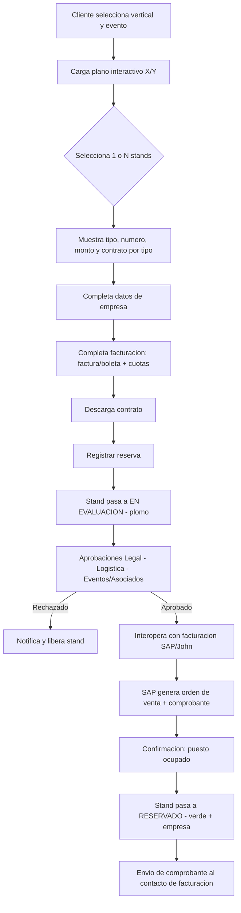
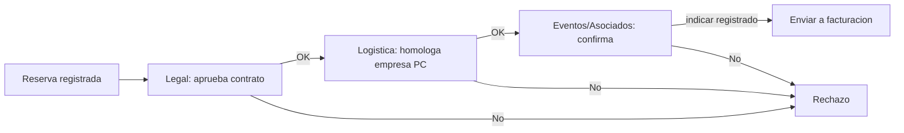
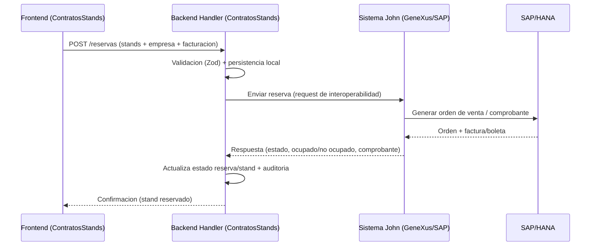
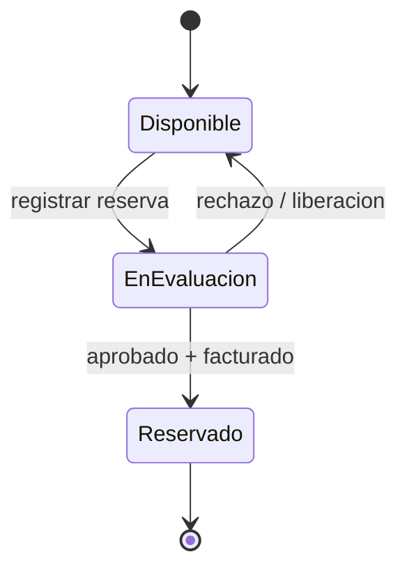
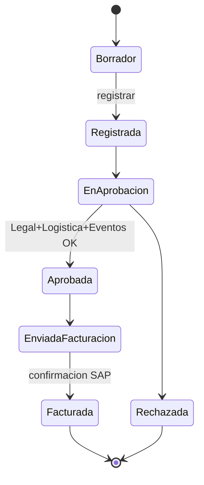

# Requerimientos del Sistema — ContratosStands (Reserva de Stands IIMP)

> **Estado:** BORRADOR v0.1 — derivado **únicamente** del onboarding técnico
> (`conversacionequipotecnico.md`). **Aún no se ha validado con el usuario/área de
> negocio interesada.** Todo lo marcado con **(PC)** = *Por Confirmar*.
>
> **Fecha:** 2026-07-08
> **Fuente:** Reunión técnica de onboarding (Edson Huamani ↔ John Morón).
> **Autor:** Equipo de desarrollo — ContratosStands.

---

## 1. Resumen ejecutivo

El IIMP requiere digitalizar y migrar a la web el proceso de **reserva de stands**
para sus eventos corporativos (**Perumin, ProExplo, World Mining Congress (WMC),
GESS**), que hoy se realiza de forma semi-manual y dependiente de un sistema legado
en **GeneXus + SAP** (sistema de John).

**ContratosStands** (este proyecto, en Next.js/React/TypeScript) actuará como un
**handler / manejador de datos y procesador de reservas**: expone el plano
interactivo de stands, captura la reserva y los datos de la empresa, permite
descargar el contrato, y **interopera** con el sistema de facturación de John (SAP)
para la emisión de comprobantes. **No** implementa contabilidad ni facturación:
esas capacidades permanecen en SAP y se consumen vía servicios.

### 1.1 Objetivo del sistema

- Automatizar la reserva de stands desde la web (uno o varios stands por operación).
- Eliminar el ingreso manual de reservas por parte de las áreas de eventos/asociados.
- Centralizar/consumir la información transversal (empresas, personas, eventos).
- Interoperar con facturación (SAP) para generar orden de venta / factura / boleta.
- Soportar **multieventos** y **multi-vertical** (Perumin/ProExplo/WMC/GESS).

---

## 2. Alcance

### 2.1 Dentro de alcance (este sistema)

- Gestión y visualización de **eventos y subeventos** (relación padre–hijo).
- **Plano interactivo** de stands (responsive, coordenadas X/Y desde servicio).
- **Reserva** de uno o varios stands.
- Captura de **datos de empresa** y **datos de facturación** (factura/boleta, cuotas).
- **Descarga del contrato** según tipo de stand.
- **Estados del stand** (disponible / en evaluación / reservado).
- **Flujo de aprobaciones** (Legal → Logística → Eventos/Asociados). *(alcance de
  orquestación; las validaciones internas de cada área son **PC**)*.
- **Interoperabilidad** con el módulo de facturación de John (envío de reserva,
  recepción de confirmación y estado ocupado/no ocupado).
- **Dashboard** de reservas registradas.

### 2.2 Fuera de alcance (se interopera, no se implementa)

- **Facturación / contabilidad**: orden de venta, comprobantes, centro de costo,
  cuentas contables, tipos de afectación, tasas → permanecen en **SAP/GeneXus**.
- **Fuente maestra de empresas/personas**: se **consume** desde el sistema de John
  y/o la base centralizada de Niel (no se crea una fuente duplicada). **(PC)**
- Generación del servicio de coordenadas X/Y del plano: **(PC)** — se decidirá si se
  reutiliza el servicio ya mapeado de John o se construye uno propio.

---

## 3. Actores y sistemas

| Actor / Sistema | Rol |
| --- | --- |
| **Empresa / Cliente** | Selecciona stand(s), completa datos, descarga contrato, registra reserva. |
| **Área Legal** | Aprueba/desaprueba el contrato (confirmado como ejecutado). |
| **Área Logística** | Homologa y valida la empresa (RUC activo, antigüedad, capacidad de emitir comprobantes, requerimientos operativos). **Validaciones exactas: PC (Mabel).** |
| **Eventos / Asociados** | Generan el requerimiento y confirman la reserva ("indicar registrado"). |
| **Contabilidad** | Configura centro de costo y cuentas contables **en SAP** (fuera de este sistema). |
| **ContratosStands (Edson)** | **Este sistema.** Handler de datos + procesador de reservas (Next.js). |
| **Sistema de John** | GeneXus + SAP (HANA). Facturación, empresas, servicio de plano X/Y, dashboard. |
| **multieventos (Niel)** | Sistema multi-evento; base de datos centralizada de empresas/personas (a compartir). |

---

## 4. Glosario

- **Vertical:** línea de evento del IIMP (proexplo, wmc, gess, perumin) — alineada con
  el UI Kit `@nrivera-iimp/ui-kit-iimp`.
- **Evento padre / subevento:** Perumin (padre) → Perumin 37, 38… (versiones/hijos).
- **Plano interactivo:** mapa de stands renderizado a partir de coordenadas X/Y.
- **Handler:** sistema que orquesta/consume datos de terceros sin ser dueño de ellos.
- **Data Provider / payload:** request que identifica `plano`, `tipoEvento`,
  `codigoEvento` para generar los puntos del mapa.
- **Campos de cámara:** `tipoCamara` y `numeroCamara` asociados a un stand.

---

## 5. Requerimientos funcionales (RF)

> Prioridad: **M** = Must, **S** = Should, **C** = Could.

### 5.1 Eventos y subeventos
- **RF-01 (M):** Modelar eventos con relación **padre–hijo** (padre + versión/evento).
- **RF-02 (M):** Toda operación (plano, reserva, stands) se filtra por
  **(eventoPadre, evento)**. Evaluar viabilidad de **un solo parámetro** vertical. **(PC)**
- **RF-03 (M):** Asociar cada evento a una **vertical** (proexplo/wmc/gess/perumin).

### 5.2 Plano interactivo de stands
- **RF-04 (M):** Renderizar el plano consumiendo **coordenadas X/Y** desde un servicio
  (payload: `plano`, `tipoEvento`, `codigoEvento`).
- **RF-05 (M):** El plano debe ser **responsive** (X/Y dinámicos; **no** width/height
  estáticos de imagen).
- **RF-06 (M):** Mostrar stands **no reservados en blanco** y **reservados con
  información visible** (empresa/estado).
- **RF-07 (M):** Al hacer clic en un stand, mostrar su **tipo, número y monto**.
- **RF-08 (S):** Distinguir visualmente estados: disponible (blanco), en evaluación
  (plomo/"parcialmente ocupado"), reservado (verde) + empresa.

### 5.3 Selección y reserva
- **RF-09 (M):** Permitir reservar **un stand** o **varios simultáneamente**.
- **RF-10 (M):** Según el **tipo de stand** (estándar, isla, preferencial…), ofrecer el
  **contrato correspondiente**.
- **RF-11 (M):** Permitir **descargar el formato de contrato** del/los stand(s).
- **RF-12 (M):** Capturar **datos de la empresa** (razón social, RUC/documento,
  personas de contacto, contacto de facturación).
- **RF-13 (M):** Capturar **datos de facturación**: comprobante (**factura/boleta**),
  y para boleta nombre/dirección/documento; para factura razón social/RUC/dirección.
- **RF-14 (M):** Capturar **cuotas** (1 o N) con **porcentajes** y **fechas de pago**
  (prorrateo si N>1); responsable de pago (nombre, teléfono, correo).
- **RF-15 (M):** Acción **Registrar reserva** → envía la reserva al dashboard/entorno
  de facturación (John).

### 5.4 Empresas (consumo / handler)
- **RF-16 (M):** **Consumir** empresas desde los endpoints de John (y/o base
  centralizada de Niel); no duplicar la fuente maestra. **(PC)**
- **RF-17 (S):** Permitir alta de empresa desde este sistema en modelo **híbrido**
  (persistir en la fuente única acordada). **(PC)**

### 5.5 Flujo de aprobaciones
- **RF-18 (M):** Orquestar aprobaciones en orden **Legal → Logística → Eventos/Asociados**.
- **RF-19 (M):** Registrar por etapa: área, responsable, estado, fecha, comentario.
- **RF-20 (S):** Reflejar el resultado de la aprobación en el estado visual del stand.
- **RF-21 (M):** Detallar validaciones de **Logística** (homologación de empresa). **(PC — Mabel)**
- **RF-22 (M):** Detallar responsabilidades específicas de Legal/Logística/Asociados. **(PC)**

### 5.6 Interoperabilidad con facturación (SAP/John)
- **RF-23 (M):** Enviar la reserva (stand(s) + empresa + facturación) al módulo de
  facturación de John y **recibir confirmación**.
- **RF-24 (M):** Recibir/actualizar el estado de **puesto ocupado / no ocupado** para
  refrescar el plano.
- **RF-25 (M):** Definir contrato de datos (endpoints, request/response) de la
  interoperabilidad. **(PC — Edson envía estructura; John envía tabla X/Y y servicio mapeado)**
- **RF-26 (S):** Idempotencia y reconciliación de reservas ↔ comprobantes.

### 5.7 Dashboard y notificaciones
- **RF-27 (S):** Dashboard de reservas con estado (registrada, en aprobación,
  aprobada, facturada).
- **RF-28 (S):** Envío de correo con contrato/comprobante al contacto de facturación.
  *(la emisión del comprobante ocurre en SAP)*.

---

## 6. Requerimientos no funcionales (RNF)

- **RNF-01 Responsividad:** el plano y toda la UI deben adaptarse a dispositivos
  (móvil/tablet/desktop). Sin dimensiones estáticas.
- **RNF-02 Performance:** render del plano y consultas de stands en tiempos
  interactivos; carga diferida de datos por evento.
- **RNF-03 Escalabilidad:** soportar multieventos y picos de concurrencia
  (empresas "fuertes" reservando varios stands).
- **RNF-04 Interoperabilidad:** integración por servicios (REST) con SAP/John y con la
  base centralizada; contratos versionados y desacoplados.
- **RNF-05 Seguridad:** validación en backend (no confiar en el frontend),
  autenticación/autorización por área, protección de endpoints, manejo de secretos por
  ambiente; sin datos sensibles hardcodeados.
- **RNF-06 Consistencia de datos:** evitar duplicidad; **fuente única** de empresas y de
  configuración contable (esta última en SAP).
- **RNF-07 Auditoría/trazabilidad:** registrar acciones clave (reservas, aprobaciones,
  interoperaciones, errores).
- **RNF-08 Theming/multi-vertical:** aplicar el design system IIMP
  (`@nrivera-iimp/ui-kit-iimp`) con verticales proexplo/wmc/gess/perumin.
- **RNF-09 Calidad de código (ZERO ERRORS):** TypeScript estricto, **sin `any`**,
  ESLint/TS en cero errores para desplegar; solo componentes del UI Kit (no HTML puro).
- **RNF-10 Accesibilidad & i18n:** compatibilidad con Google Translate (regla Radix:
  envolver textos en `` en componentes de portal).
- **RNF-11 Mantenibilidad:** arquitectura por capas (repository/service/handler);
  módulos desacoplados para facilitar la migración progresiva del legado.
- **RNF-12 Disponibilidad:** objetivo de servicio para periodos de campaña de eventos. **(PC)**

---

## 7. Arquitectura por capas

### 7.1 Capa FRONTEND
- **Stack:** Next.js (App Router) + React + TypeScript + Tailwind v4 + UI Kit IIMP.
- **Responsabilidades:**
  - Selector de **vertical** y de **evento/subevento**.
  - **Plano interactivo responsive** (consumo de X/Y; estados por color).
  - Flujo de **selección múltiple** de stands + panel de detalle (tipo, número, monto).
  - Formularios de **empresa**, **facturación** y **cuotas** (React Hook Form + Zod).
  - **Descarga de contrato** por tipo de stand.
  - Vistas de **dashboard** y seguimiento de estado.
- **Lineamientos:** solo componentes del UI Kit; tipado estricto; regla Radix +
  Google Translate; theming por vertical.

### 7.2 Capa BACKEND
- **Stack:** Route Handlers de Next.js (API) + capa de servicios + validación Zod.
- **Patrón:** **handler/orquestador** — separación `repository` (datos) / `service`
  (lógica) / `route handler` (API).
- **Responsabilidades:**
  - Endpoints de **reserva** (crear, consultar, cambiar estado).
  - **Orquestación de aprobaciones** (Legal→Logística→Eventos/Asociados).
  - **Adaptadores de interoperabilidad**: cliente hacia facturación (SAP/John) y hacia
    empresas/eventos; manejo de request/response, reintentos e idempotencia.
  - **Validación estricta** de entradas; nunca confiar en el frontend.
  - **Auditoría** de operaciones.

### 7.3 Capa BASE DE DATOS
- **Estrategia:** persistir **solo lo propio del proceso de reserva**; **consumir**
  (no duplicar) empresas/personas y configuración contable.
- **Entidades propias (propuestas):**
  - `evento_padre` (perumin, proexplo, wmc, gess)
  - `evento` (versión: `codigoEvento`, `tipoEvento`, verticalId, planoRef)
  - `tipo_stand` (nombre, medidas, monto base, plantilla de contrato)
  - `stand` (numero, tipoStandId, monto, medidas, `tipoCamara`, `numeroCamara`, estado)
  - `plano_posicion` (standId, x, y) — origen: servicio de John **(PC)**
  - `reserva` (eventoId, empresaRef, tipoComprobante, datosFacturacion, estado, timestamps)
  - `reserva_stand` (reservaId, standId, tipoStand, monto)
  - `cuota` (reservaId, numero, porcentaje, monto, fechaPago)
  - `aprobacion` (reservaId, area, estado, responsable, comentario, fecha)
  - `interop_facturacion` (reservaId, ordenVenta, comprobante, estado, requestRef, responseRef)
  - `audit_log` (tipo, mensaje, entidad, actor, metadata, fecha)
- **Entidades consumidas (externas):** `empresa`, `persona_contacto`, configuración
  contable (centro de costo, cuentas, afectación) — **origen SAP/centralizado**.
- **Índices críticos (PC):** unicidad de stand por evento/estado; unicidad de reserva
  activa por stand+evento para evitar doble reserva.

---

## 8. Flujogramas de proceso

### 8.1 Flujo general de reserva

### 8.2 Flujo de aprobaciones

### 8.3 Interoperabilidad (secuencia)

### 8.4 Estados del stand

### 8.5 Estados de la reserva

---

## 9. Implicancias a nivel micro y macro

### 9.1 Micro (técnicas / de producto)
- Contratos de datos tipados y validados (Zod) para reserva, empresa y facturación.
- Plano **responsive** real (coordenadas relativas, no px estáticos).
- Sincronización de **estados del stand** con la confirmación de facturación
  (consistencia eventual → riesgo de doble reserva si no hay bloqueo/idempotencia).
- Generación/descarga de **contrato por tipo de stand** (plantillas).
- Manejo de **selección múltiple** (transacción de N stands en una reserva).
- Compatibilidad UI (UI Kit, Radix + Google Translate, theming por vertical).
- Reintentos, timeouts y **idempotencia** en la interoperabilidad.

### 9.2 Macro (organizacionales / estratégicas)
- **Reducción de dependencia** del sistema legado (GeneXus/escritorio SAT) y
  migración progresiva a la nube.
- **Centralización de datos transversales** (empresas, personas, eventos) en una
  **fuente única** compartida (evita duplicidad y "cortar el caño" a futuro).
- **Gobierno de la configuración contable** en SAP (no duplicar en la web).
- **Interoperabilidad** como principio: cada sistema dueño de su dominio.
- Escalamiento **multieventos / multi-vertical** para todo el portafolio IIMP.
- Impacto en **procesos de las áreas** (Legal/Logística/Eventos): dejan de ingresar
  reservas manualmente; requiere gestión del cambio y definición de responsabilidades.

---

## 10. Capa de documentación

Estructura propuesta en `docs/`:

- `requerimientos.md` — este documento (funcionales, no funcionales, arquitectura).
- `arquitectura.md` — diagramas C4/componentes y decisiones (ADR). **(pendiente)**
- `modelo-datos.md` — entidades propias vs. consumidas, diccionario de datos.
- `endpoints.md` — contrato de interoperabilidad (request/response, ejemplos). **(PC)**
- `flujos.md` — flujogramas de negocio (fuente de los diagramas Mermaid).
- `plan-pruebas.md` — casos de prueba y criterios de aceptación.
- `manual-usuario.md` / `manual-despliegue.md`.
- `bitacora-cambios.md` (CHANGELOG) y `preguntas-abiertas.md`.

Convenciones: Markdown + diagramas **Mermaid**; versionado en el repo; toda decisión
técnica relevante se registra como ADR.

---

## 11. Capa de despliegue (ambientes Dev y QA)

> Infraestructura concreta (cloud/PaaS) **PC**. Referencia: el ecosistema IIMP usa
> Next.js + Docker + Terraform + AWS (p. ej. RDS) y/o Netlify.

| Aspecto | **Dev** | **QA** |
| --- | --- | --- |
| Rama | `develop` | `qa`/`release` **(PC)** |
| Objetivo | Integración continua del equipo | Validación funcional / UAT |
| Datos | Base de datos de desarrollo (datos sintéticos) | Base QA (datos de prueba realistas) |
| Interop | Endpoints **Dev** de John/SAP (sandbox) **(PC)** | Endpoints **QA** de John/SAP **(PC)** |
| Variables | `.env` Dev (secretos por gestor de secretos) | `.env` QA (secretos por gestor) |
| Calidad | `lint` + `tsc --noEmit` en cada push | Regresión + criterios de aceptación |
| Despliegue | Automático desde `develop` | Manual/aprobado desde `qa` |

Lineamientos de despliegue:
- **Pipeline ZERO ERRORS:** `lint` + `typecheck` obligatorios; build lo ejecuta el
  responsable designado.
- **Configuración por ambiente:** URLs de interoperabilidad, credenciales y flags
  parametrizadas por variable de entorno; **sin secretos en el repo**.
- **Contenerización:** imagen Docker reproducible (Dev/QA). **(PC)**
- **IaC:** Terraform para provisionar recursos de cada ambiente. **(PC)**
- **Migraciones de BD** versionadas y ejecutadas por ambiente.
- **Observabilidad:** logs de auditoría e interoperabilidad centralizados.

---

## 12. Preguntas clave abiertas (del onboarding)

| # | Pregunta / Tema | Responsable | Estado |
| --- | --- | --- | --- |
| Q1 | Participación de Logística y Eventos/Asociados en la reserva | Mabel/Negocio | Abierta |
| Q2 | Validaciones específicas de Logística (homologación de empresa) | **Mabel** (documentar) | Abierta |
| Q3 | ¿Un solo parámetro vertical para multieventos vs. padre+evento? | **Edson** (probar y reportar) | En prueba |
| Q4 | ¿Se construye el servicio X/Y o se reutiliza el de John? | **Edson** (decidir tras evaluar) | Abierta |
| Q5 | Estructura de la información y **endpoints** de interoperabilidad | **Edson** (enviar) / **John** | Abierta |
| Q6 | Tabla de coordenadas **X/Y** y servicio mapeado del plano | **John** (enviar a Edson) | Comprometido |
| Q7 | Campos de stand (tipo, monto, número) y campos de **cámara** | **John** (proveer) | Comprometido |
| Q8 | ¿Fuente única de empresas? (compartir BD de Niel) | **Niel** (compartir BD) | Abierta |
| Q9 | Responsabilidades exactas de Legal/Logística/Asociados | Negocio | Abierta |
| Q10 | Origen del formato/config de stands (Excel/escritorio SAT) | **John** | Informado |

### Puntos de acción comprometidos
- **Mabel:** documentar funciones/validaciones de Logística.
- **Edson:** enviar estructura + endpoints de interoperabilidad; probar vertical de un
  solo parámetro; implementar el servicio web de reservas e interoperar con facturación;
  incorporar eventos/subeventos al registrar reserva; preparar el handler para el payload
  del plano; decidir crear vs. reutilizar el servicio.
- **Niel:** compartir la base de datos de empresas/personas.
- **John:** enviar tabla X/Y y estructura de posicionamiento; proveer campos de stand y
  cámara; enviar el servicio mapeado y parámetros X/Y.

---

## 13. Supuestos y riesgos

**Supuestos**
- La facturación/contabilidad permanece en SAP; este sistema solo interopera.
- Existe una fuente maestra (o se creará) para empresas/personas.
- El servicio de plano (X/Y) estará disponible desde el sistema de John.

**Riesgos**
- **Dependencia del legado** (GeneXus/SAP) durante la transición.
- **Contrato de interoperabilidad no definido** (Q5/Q6) → bloquea reserva y plano.
- **Duplicidad de datos** si no se acuerda la fuente única de empresas.
- **Doble reserva** por falta de bloqueo/idempotencia en la sincronización de estados.
- **Requerimientos de negocio sin validar** (no se ha hablado con el usuario interesado)
  → alta probabilidad de cambios en RF de aprobaciones y validaciones.

---

## 14. Próximos pasos

1. **Validar este documento con el usuario/área de negocio** (pendiente clave).
2. Cerrar el **contrato de interoperabilidad** (endpoints, X/Y, campos de stand/cámara).
3. Definir la **fuente única de empresas** y el modelo de consumo.
4. Confirmar **infraestructura** de Dev/QA y estrategia de despliegue.
5. Detallar **validaciones por área** (Legal/Logística/Comunicación).

---

## 15. Estado actual de implementación (v0.2)

### 15.1 Funcionalidades implementadas

| Funcionalidad | Estado |
|---|---|
| Plano isométrico 3D (52 bloques, multi-select, reserva 3 pasos) | Completo |
| Plano grid 2D (52 bloques, selección, reserva) | Completo |
| Personas 3D en plano isométrico (capsula geometry) | Completo |
| Selección de evento (ProExplo/WMC/GESS/PERUMIN) con dialog | Completo |
| Proxy API planogess (KBEventos) con SSL self-signed | Completo |
| Sincronización API→BD (GessStand) con auto-detección de campos | Completo |
| Mantenedor GESS: importar + vincular stands a bloques 3D | Completo |
| Vinculación GessStand ↔ bloques isométricos (bloqueId) | Completo |
| Dashboard KPIs + pipeline de aprobaciones | Completo |
| Autenticación JWT (login, middleware, roles) | Completo |
| Gestión de roles y permisos (admin/logistica/legal/comunicacion) | Completo |
| Fachada de servicios (mock/http) + DTO/Mapper | Completo |
| PostgreSQL + Prisma v7 + Docker | Completo |
| Multi-ambiente (local/qa/production) | Completo |

### 15.2 Áreas de aprobación

| Área | Rol | Permisos |
|---|---|---|
| Logística | `logistica` | `read:reservas`, `approve:logistica` |
| Legal | `legal` | `read:reservas`, `approve:legal` |
| Comunicación | `comunicacion` | `read:reservas`, `approve:comunicacion` |
| Admin | `admin` | `admin:full`, todos los anteriores |

### 15.3 Pendientes

- **(PC)** Contrato de interoperabilidad con John/SAP
- **(PC)** Fuente única de empresas (integración con sistema de Niel)
- **(PC)** Endpoint real de planogess en producción
- Emisión de comprobantes vía SAP
- Notificaciones por correo
- Testing automatizado (unit + e2e)
